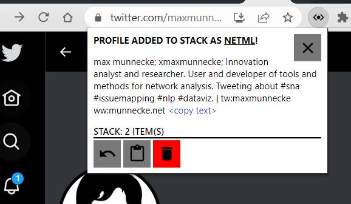

# Twitter profile to NetML

The "Twitter profile to NetML" chrome extension reads a Twitter profile webpage and summarizes key profile information in a NetML formatted line of text.

[NetML](https://munnecke.net/blog/introducing-netml/) is a practical markup language that aims to store network information so it is easily readable to humans and machines.

The NetML formatted text can be copied and pasted into documents where such information is stored, organised and read by programs. The simple text format makes it also straight forward to share and collaborate online with version control.

By default each entry is stored in a stack when the extension is pressed while visiting a twitter profile webpage, so that multiple profiles can be processed before copying the text to the clipboard and pasting elsewhere. If the logged in user profile in the browser is synced, the stack will also be syncronized across browser windows and devices.

*Workflow*
- browse twitter profile webpages and press then icon of the "Twitter profile to NetML" chrome extension when you want to save any of them to the stack. If you regret, you can always remove the lastest entry from the stack using the "revert" button.
- press the "clipboard" button when you are done and want to copy the whole stack of NetML formatted entries to another document.
- press "clear" to empty the stack.

*How to install*
1. Save the extension folder on your device.
2. Go to chrome://extensions/ in your browser.
3. At the top right, turn on "Developer mode".
4. Click "Load unpacked".
5. Find and select the extension folder and the extension is ready to be used.